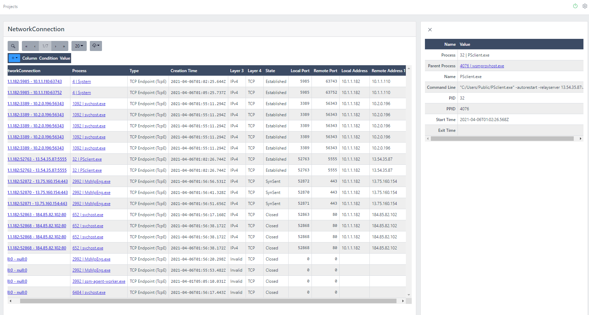

The challenge can be downloaded here along with all the details - https://www.cyber.gov.au/acsc/view-all-content/news/acsc-cyber-security-challenge.

Big thanks to the ACSC for putting this together and sharing the content.

# Setup
So I could pretend to play along I setup an instance of ctfd locally in docker for windows.
1. https://hub.docker.com/r/ctfd/ctfd
2. Ran "docker run -p 8000:8000 -it ctfd/ctfd:3.3.1-release" to download the image locally, this was the version that worked for me when i imported the config.
3. Imported the provided ctfd_config.zip to my instance.

## 1 - Getting Started
### GS-0
Press submit on this one to continue.
### GS-1
How many hosts have we received data from?
Flag format: Number

* Easy one, just count the number of zip files provided as they named by host.
* Flag = 9

Get-FileHash  -Algorithm MD5 | Format-List

### GS-3
#### Volatility
(13Cubed) Volatility 3 and WSL 2 - Linux DFIR Tools in Windows? - https://youtu.be/rwTWZ7Q5i_w

https://github.com/volatilityfoundation/volatility3/releases
https://pip.pypa.io/en/latest/user_guide/#installing-from-wheels

#### TrufflePig Forensics
https://trufflepig-forensics.com/

Initial Access - 1

Something for later

https://www.cyber.gov.au/acsc/view-all-content/advisories/advisory-2020-004-remote-code-execution-vulnerability-being-actively-exploited-vulnerable-versions-telerik-ui-sophisticated-actors

4/1/21
1:49:08.000 PM	
2021-04-01 02:49:08 10.1.0.80 POST /Telerik.Web.UI.WebResource.axd type=rau 80 - 13.54.35.87 python-urllib3/1.26.2 - 500 0 0 52
c_ip = 13.54.35.87host = dmz-webpubsource = u_ex210401.logsourcetype = iis

Flag = 13.54.35.87

Initial Access - 2

	4/1/21
1:46:33.000 PM	
2021-04-01 02:46:33 10.1.0.80 GET /Telerik.Web.UI.WebResource.axd type=rau 80 - 13.54.35.87 Mozilla/5.0+(Windows+NT+10.0;+Win64;+x64;+rv:54.0)+Gecko/20100101+Firefox/54.0 - 200 0 0 11
c_ip = 13.54.35.87host = dmz-webpubsource = u_ex210401.logsourcetype = iis
CVE-2019-18935

next time - Install volatility in WSL2
parse MFT - Autopsy and EZTools
