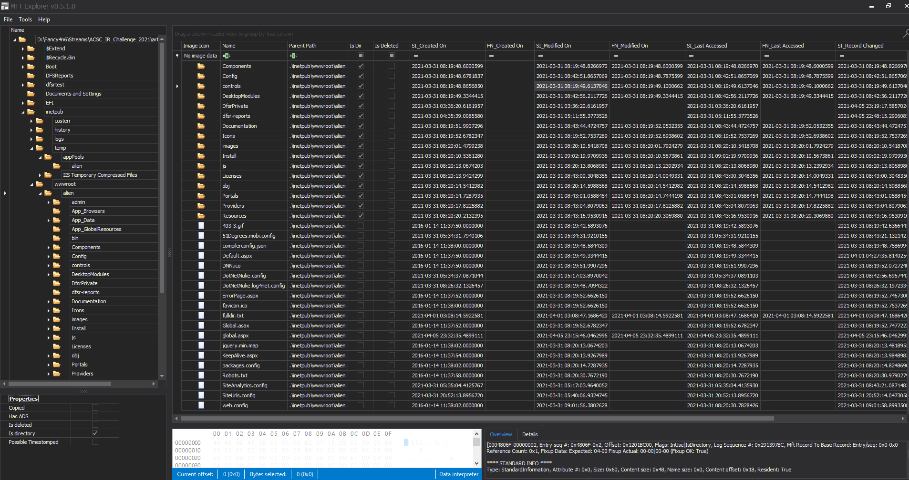

# Section 4 - Privilege Escalation
**So the actor was aware that sample 2 was replicated onto CORP-WEBDEV, giving them access further into the network. What would they have done next?**

4/1/2021  3:35:00 AM lsass.dmp

# PE-1
*It looks like the actor ran some more reconnaissance commands and, once again, forgot to clean up after themselves. What time (UTC) was the file containing the command's output created?*
* Back to the MFT output and looking around we see the following file that looks suspect and something like it could be the output of a tool:
  * ParentPath: .\inetpub\wwwroot\alien
  * FileName: fulldir.txt
  * Timestamp: 2021-04-01 03:08:14.592

**Flag: 2021-04-01 03:08:14**

# M-2
*What time (UTC) was the fulldir.txt file created on the dmz-webpub server?*
* Back to the MFT output on dmz-webpub:
  * ParentPath: .\inetpub\wwwroot\alien
  * FileName: fulldir.txt
  * Timestamp: 2021-04-01 03:08:14.592
* Exactly the same timestamp
**Flag: 2021-04-01 03:08:14**

# PE-2
*What user account was the actor running these commands as?*

**Flag:**

# M-3
*What command did the actor run at 2021-04-01 03:25:44?*

**Flag:**

# PE-3
*The actor needed legitimate credentials with higher privilege to continue their attack. What account did they use which had higher privileges?*

**Flag:**

# M-4
*ALIEN are concerned about the actor using this account - it's an account only used by DotNetNuke to communicate with the supporting database. Potentially the credentials were hard-coded somewhere! Which file could the actor have possibly rooted this password out from?*

**Flag:**

# PE-4
*What time (UTC) did the actor first use this account to continue with their malicious tasks?*

**Flag:**

# PE-5
*Continuing to flex there new credentials, the actor then started a process. What was the PID of this first process?*

**Flag:**

# PE-6
*What time (UTC) was the output of this process created on disk?*

**Flag:**