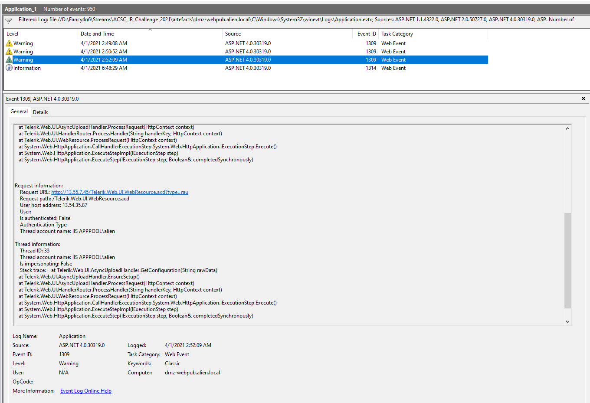

# IA-1
The actor seems to have initially failed to install themselves on the web server. What IP address did their malicious wizardry come from?
* You can get Splunk Enterprise on a free trial license for non commercial use - https://www.splunk.com/en_us/download/get-started-with-your-free-trial.html which is handy to have for these things and to play and learn Splunk on.
* You can upload a zip file of all the provided IIS log files to Splunk and I created an index for the challenge.
1. Started by removing the local ip of 10.1.0.80 from the results
   ```
   index="acsc_ir_challenge_2021"
   | sort _time
   | where NOT c_ip="10.1.0.80"
   ```
2. In general, GET requests are what we'll see for normal traffic to a website, so i filtered on POST requests to see what came back.
   ```
	index="acsc_ir_challenge_2021"
	| sort _time
	| where NOT c_ip="10.1.0.80"
	| where cs_method="POST"
   ```
3. Traffic originating from 13.54.35.87 sticks out in the listing with multiple POST requests to /Telerik.Web.UI.WebResource.axd. So ill filter on that IP now.
   ```
   index="acsc_ir_challenge_2021"
   | sort _time
   | where c_ip="13.54.35.87"
   ```
4. there was a clue in the question so the following event was the one related:

	```
	2021-04-01 02:35:41 10.1.0.80 GET /Install/InstallWizard.aspx __VIEWSTATE=&culture=en-US&executeinstall 80 - 13.54.35.87 Mozilla/5.0+(Windows+NT+10.0;+Win64;+x64;+rv:54.0)+Gecko/20100101+Firefox/54.0 - 404 0 0 42
	```

Their malicious 'wizardry' that failed (404 status)

Flag: 13.54.35.87

# IA-2
It looks like the actor eventually succeeded in gaining access using a combination of multiple well-documented CVEs. Which of these is the most recent?

* The first indication in the log files that they were successful in gain access (status 500) is the log entry:
	```
	2021-04-01 02:49:08 10.1.0.80 POST /Telerik.Web.UI.WebResource.axd type=rau 80 - 13.54.35.87 python-urllib3/1.26.2 - 500 0 0 52
	c_ip = 13.54.35.87host = dmz-webpubsource = u_ex210401.logsourcetype = iis
	```
* Googling `/Telerik.Web.UI.WebResource.axd` and CVE makes it pretty clear that there are a few CVEs bouncing about, but they have asked for the most recent. Coioncidentally an advisory was put out by the ACSC in 2020 that has the interesting details in it - https://www.cyber.gov.au/acsc/view-all-content/advisories/advisory-2020-004-remote-code-execution-vulnerability-being-actively-exploited-vulnerable-versions-telerik-ui-sophisticated-actors

Flag: CVE-2019-18935

* on a side note and maybe for later, the advisory talked about evidence of the exploit in application event logs, so i jumped in to correlate those.
  

# IA-3
What was the filename of the first file created by the actor to test that their exploit worked? (We'll refer to this test file as sample 1)
Flag format - filename.ext


# IA-4
After calling home, the actor finally succeeded in dropping their core tool, sample 2.What time (UTC) was this tool first used?


Something for later


next time - Install volatility in WSL2
parse MFT - Autopsy and EZTools
