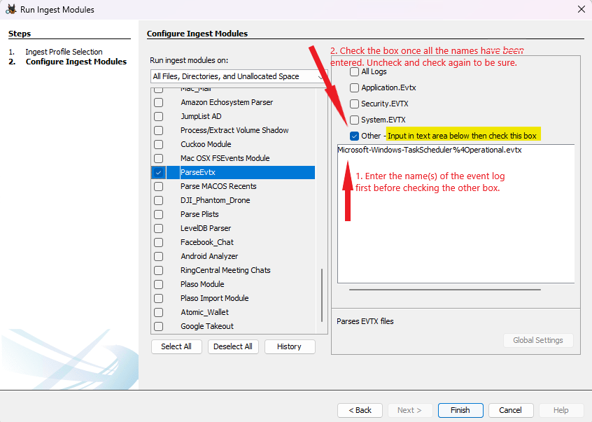
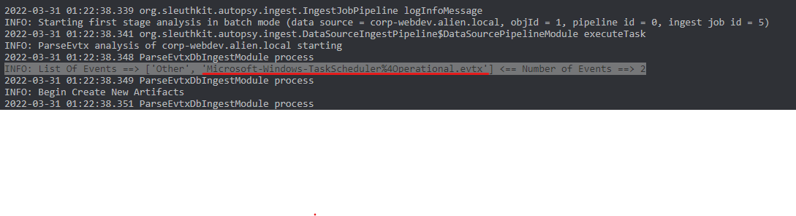

This is my set up and instructions for running Autopsy in a test environment for my purposes.

# Table of Contents
1. [The Base System](#TheBaseSystem)
2. [Install Autopsy](#InstallAutopsy)
3. [Turn on WAL Journaling](#WalJournaling)
4. [Python Plugins](#PythonPlugins)
   * [ParseEvtx](#Parse_Evtx)

# The base system 
| Item                            | Value                                                                                  |
| ------------------------------- | -------------------------------------------------------------------------------------- |
| OS Name                         | Microsoft Windows 11 Pro                                                               |
| Version                         | 10.0.22581 Build 22581                                                                 |
| Processor                       | Intel(R) Core(TM) i7-9750H CPU @ 2.60GHz, 2592 Mhz, 6 Core(s), 12 Logical Processor(s) |
| Installed Physical Memory (RAM) | 32.0 GB                                                                                |
| Total Physical Memory           | 31.9 GB                                                                                |
| Available Physical Memory       | 21.7 GB                                                                                |
| Total Virtual Memory            | 36.7 GB                                                                                |
| Available Virtual Memory        | 25.2 GB                                                                                |
| Page File Space                 | 4.75 GB                                                                                |

# Download and install the latest version of Autopsy 
* Autopsy doesn't upgrade, it installs the next version alongside the old one. Remove the older version when you are happy the new version is working for you.

1. I've installed into C:\Program Files\Autopsy-4.19.3\
   1.  1TB (onboard) SSD

# Turn on Wal journaling to speed up Single Case Mode 
This is a tip that Mark McKinnon shared with me.
1. Download an SQLite database editor. SQLite Spy for example.
2. Open Autopsy and create a new case.
3. Fill out all information to create the new case.
4. Once you get to the step of adding a data source to the case cancel it by hitting the cancel button.  The case has been created and ready to get the journaling mode changed from delete to Wal. 
   1. (ref - https://github.com/sleuthkit/autopsy/issues/2518)
5. Run SQLiteSpy
6. Open Database > Browse to the case folder and open Autopsy.db
7. Issue the following SQL command: Pragma Journal_Mode='wal' and execute it.  
8. You should see that the journal mode is now wal.
9. Close the database and close your SQLite editor.
10. Open the case that you just created and add your data sources as normal.

# Adding Python Plugins 
https://github.com/markmckinnon/Autopsy-Plugins
These plugins greatly increase the number of ingest parsers that can run by Autopsy.
1. Open Autopsy
2. Go to Tools > Python Plugins. This will open the directory where the plugins should reside - C:\Users\<username>\AppData\Roaming\autopsy\python_modules
3. Clone Mark's repository above.
4. For simplicity it can be good to only copy the plugins that you are planning on using rather than the whole repository.

## Running ParseEvtx Python Ingest Module 
1. If you add the name of an event log under other, you must add the name and THEN check the other box. To be sure I check it on then off and then on again. Separate the names with a comma. 

2. You know it's worked when you get the logs in Autopsy OR you check the log file and the list of names appears next to "Other"
   

