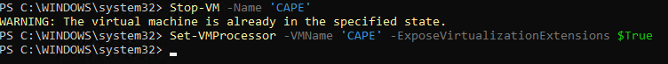
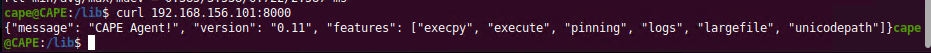

# Setting up CAPE for fun (and profit)
I've used CAPE and found it really really useful and wanted to set up an instance to play with and go through the process to understand how its put together.

Running CAPE in a virutalised environment isn't ideal due to the need for virtualisation in virtualisation, but for my purposes it should be ok.

For ease I'm using Hyper-V which I've enabled under Windows 11.

> CAPE Sandbox is an Open Source software for automating analysis of suspicious files. To do so it makes use of custom components that monitor the behavior of the malicious processes while running in an isolated environment.

## Install Ubuntu Desktop under Hyper-V
* Create new VM (I'll refine this section and see what works best and update)
* Test whether Generation 1 or Generation 2 works

### Enable nested virtualisation
Running PowerShell terminal as admin

```
PS C:\WINDOWS\system32> Get-VM

Name                       State   CPUUsage(%) MemoryAssigned(M) Uptime             Status             Version
----                       -----   ----------- ----------------- ------             ------             -------
CAPE                       Off     0           0                 00:00:00           Operating normally 11.0
```
* Ensure the VM is stopped

```
Stop-VM -Name 'CAPE'
```
* Now that the state of your VM is set to ‘Off’, you can enable nested virtualization. The only way to enable it is using PowerShell. 

```
Set-VMProcessor -VMName 'CAPE' -ExposeVirtualizationExtensions $True
```
That should do it.



## Get Ubuntu set up and install CAPE
Start the CAPE VM and Connect.

Make sure Ubuntu is up to date.
```
sudo apt update
sudo apt upgrade -y
```
For me I want to update the resolution for the VM
```
sudo vi /etc/default/grub
```
Update the following lines:

`GRUB_CMDLINE_LINUX_DEFAULT="quiet splash video=hyperv_fb:1920x1080"`

`GRUB_CMDLINE_LINUX="quiet splash video=hyperv_fb:1920x1080"`

Save and exit

In a terminal you'll need to run
```
sudo update-grub
```
Restart the VM

### Take a checkpoint (snapshot)
* Action > Checkpoint
* Name the Checkpoint
* Select Yes.
* Wait until the checkpoint has been taken and finished before continuing.

### Install Python3 and pip
```
sudo apt install python3 python3-pip -y
```

### Install Pillow (9.0.1 was the latest at this time)
```
pip3 install Pillow==9.0.1
```
### The work is already done using this script
```
wget https://raw.githubusercontent.com/doomedraven/Tools/master/Sandbox/cape2.sh
chmod a+x cape2.sh
sudo ./cape2.sh base cape
sudo apt autoremove
```

### Install MongoDB
```
sudo apt install -y mongodb
sudo apt autoremove
```
### Install Wormhole to transfer files between Ubuntu and the VMs
```
sudo apt install wormhole -y
```
ref: https://github.com/magic-wormhole/magic-wormhole


### Take a checkpoint (snapshot)
* Action > Checkpoint
* Name the Checkpoint
* Select Yes.
* Wait until the checkpoint has been taken and finished before continuing.

## Virtual Machine Creation using KVM
The virtual machines are environments in which samples are detonated.

First step is to install KVM (machine) and virt-manager so we can create virtual machines.

```
sudo apt install qemu-kvm libvirt-daemon-system libvirt-clients bridge-utils -y
sudo adduser cape libvirt
sudo adduser cape kvm
sudo systemctl enable --now libvirtd
sudo apt install virt-manager -y
sudo virt-manager
```

### virt-manager GUI
You'll need the iso's of the operating systems you wish to set up downloaded locally on the ubuntu system.

>Handy hint - https://zeltser.com/free-malware-analysis-windows-vm/#step2

If you do this, you need to convert the vhdx file to a qcow2 file
```
sudo mkdir /var/lib/libvirt/images/Windows10x64
sudo qemu-img convert-0 qcow2 MSEdge\ -\ Win10.vhdx /var/lib/libvirt/images/Windows10x64/Windowsx64.qcow2
```

Password: Passw0rd!

>Instructions to use virt-manager here - https://phoenixnap.com/kb/ubuntu-install-kvm#ftoc-heading-6

Im going to start noting the settings here ready for command line usage as I get more familiar and figure out what specs are needed
```
sudo virt-install --name=Windows10x64 \
--desccription='Windows 10 (x64) \
--ram=2048 \
--vcpus=2 \
--disk path=/var/lib/libvirt/images/Windows10x64/Windowsx64.qcow2,size=40 \

```

| System | Description          | Operating System                   | Memory | CPUs     | Disks |
| ------ | -------------------- | ---------------------------------- | ------ | -------- | ----- |
| Laptop | Host system          | Windows 11 Running Hyper-V manager | 32GB   |          |
| CAPE   | CAPE virtual Machine | Ubuntu 20.04                       | 8GB    | 6 x vCPU | 128GB |
|        |                      |                                    |        |          |
|        |                      |                                    |        |          |

https://notes.netbytesec.com/2020/12/cape-sandbox-installation-from-0-to-hero.html

### Install these on the Windows VM (to be completed)
https://www.python.org/ftp/python/3.10.3/python-3.10.3-amd64.exe

> Need to look at the customisations such as disabling firewall and AV and UAC.

## Install the CAPE agent on the VM
https://raw.githubusercontent.com/kevoreilly/CAPEv2/master/agent/agent.py

## Cuckoo Configurations
### cuckoo.conf
```
vi /opt/CAPEv2/conf
```
`machinery = kvm`

Should already be set

`[resultserver]`
`ip = 192.198.156.1`

### kvm.conf
`interface = virbr1`
`label = Windows10x64`
`ip = 192.168.156.101`
`snapshot = Snapshot1`





